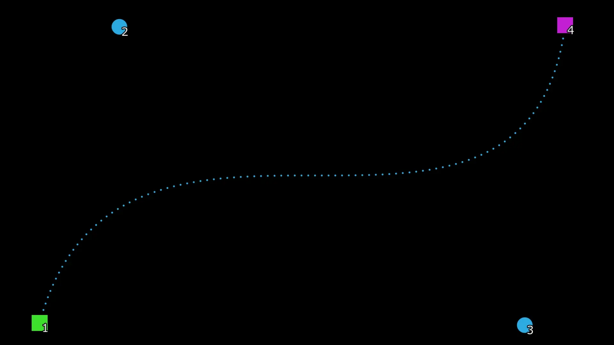

# BezierPath

ベジェ曲線としてパスを描いて、それに沿って移動できるやつです

※サンプル映像には[ObjectMotionBlur_LK](https://github.com/korarei/AviUtl2_ObjectMotionBlur_LK_Script)を使用しています

## 最新 / Latest

**r3**

## 各パラメータ

* ### オフセット
> 適応オブジェクトの表示位置を調整します。

* ### 回転
> 適応オブジェクトを回転します。
>
> 個別オブジェクトの場合、それぞれが回転します。

* ### 字間倍率
> 文字同士の間隔を調整します。
>
> 作成したベジェ曲線に応じて間隔が変動してしまうので、これで調整してください。

* ### 次数
> ベジェ曲線の次数を変更します。

* ### 向く
> 曲線に応じて自動的に回転するかどうか。

## 変更履歴 / Change log

- r3
  - 軽量化
  - ObjectMotionBlur_LKが正常に付与できない問題の修正
  - ガイド表示がONのとき、オブジェクトにフィルタ効果がかからない問題の修正
  - ガイド用オプションに線密度を追加

- r2
  - ガイド表示のオプションをグループから除外

- r1
  - 初版